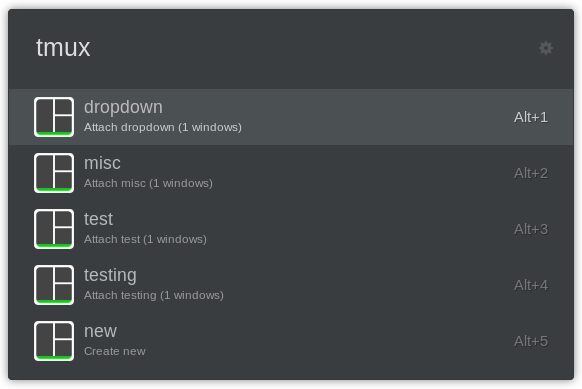

# Ulauncher Tmux extension

Another hacky extension for the [ulauncher](https://ulauncher.io/), this time for Tmux.

It searches your open sessions and attaches to them.

If no sessions found, you can create new one.

This extension uses gnome-terminal by default. If your terminal emulator is different, you should check and edit the parameters in settings.

For example:

| Terminal  | Attach parameters             | New session parameters            |
| --------- | ----------------------------- | --------------------------------- |
| `kitty`   | `tmux a -t '%s'`              | `tmux new -s '%s'`                |
| `konsole` | `--new-tab -e 'tmux a -t %s'` | `--new-tab -e 'tmux new -s %s'`   |

## License

[MIT](LICENSE)

Copyright for portions of project ulauncher-tmux are held by user seqizz on github.com (@seqizz), 2021 as part of project ulauncher-tmux-attach. All other copyright for project ulauncher-tmux are held by Adrian Haasler García, 2021.
